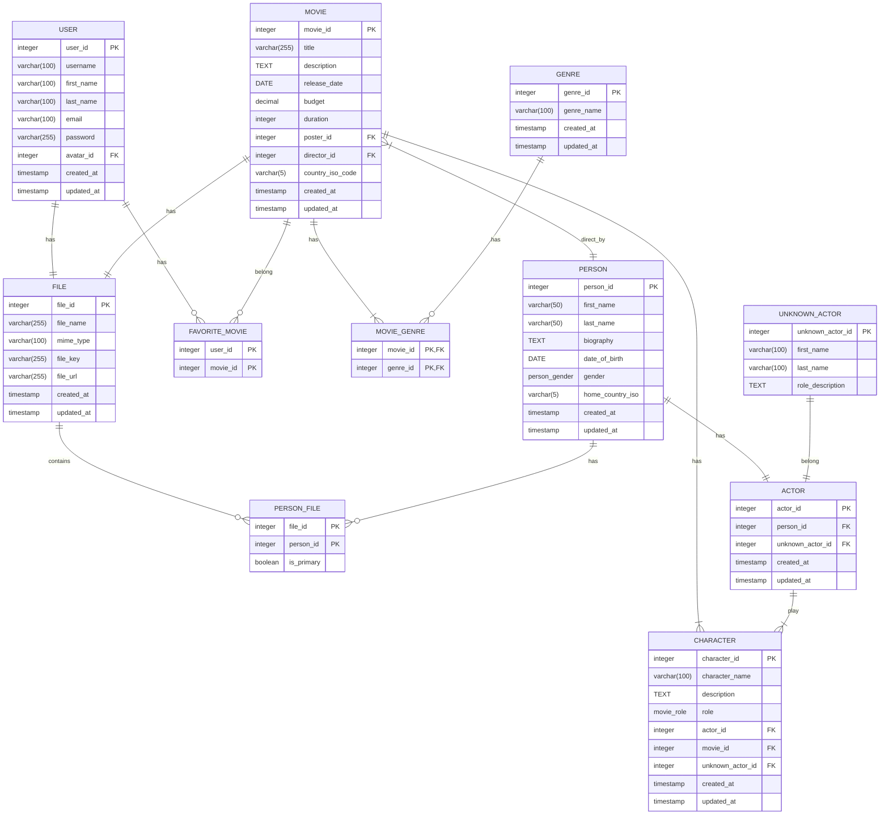

# lecture-DB-SQL

```mermaid
erDiagram
    USER ||--|| FILE : has
    USER ||--o{ FAVORITE_MOVIE : has
    USER{
        integer user_id PK
        varchar(100) username 
        varchar(100) first_name
        varchar(100) last_name
        varchar(100) email
        varchar(255) password
        integer avatar_id FK
        timestamp created_at
        timestamp updated_at

    }
    FILE ||--o{ PERSON_FILE : contains
    FILE{
        integer file_id PK
        varchar(255) file_name
        varchar(100) mime_type 
        varchar(255) file_key
        varchar(255) file_url
        timestamp created_at
        timestamp updated_at
    }
    MOVIE ||--|| FILE : has
    MOVIE ||--|{ MOVIE_GENRE : has
    MOVIE ||--o{ FAVORITE_MOVIE : belong
    MOVIE ||--|{ CHARACTER : has
    MOVIE |{--|| PERSON : direct_by
    MOVIE{
        integer movie_id PK
        varchar(255) title 
        TEXT description
        DATE release_date
        decimal budget
        integer duration 
        integer poster_id FK
        integer director_id FK
        varchar(5) country_iso_code
        timestamp created_at
        timestamp updated_at
    }
    GENRE ||--o{ MOVIE_GENRE : has
    GENRE{
        integer genre_id PK
        varchar(100) genre_name
        timestamp created_at
        timestamp updated_at
    }
    MOVIE_GENRE{
        integer movie_id PK, FK
        integer genre_id PK, FK
    }

    CHARACTER{
        integer character_id PK
        varchar(100) character_name
        TEXT description
        movie_role role
        integer actor_id FK
        integer movie_id FK
        integer unknown_actor_id FK
        timestamp created_at
        timestamp updated_at
    }
    PERSON ||--o{ PERSON_FILE : has
    PERSON ||--|| ACTOR : has
    PERSON{
        integer person_id PK
        varchar(50) first_name
        varchar(50) last_name
        TEXT biography
        DATE date_of_birth
        person_gender gender
        varchar(5) home_country_iso
        timestamp created_at
        timestamp updated_at
    }
    PERSON_FILE{
        integer file_id PK
        integer person_id PK
        boolean is_primary
    }
    UNKNOWN_ACTOR ||--|| ACTOR : belong
    UNKNOWN_ACTOR{
        integer unknown_actor_id PK
        varchar(100) first_name
        varchar(100) last_name
        TEXT role_description 
    }

    FAVORITE_MOVIE{
        integer user_id PK
        integer movie_id PK
    }
    ACTOR ||--|{ CHARACTER : play
    ACTOR{
        integer actor_id PK
        integer person_id FK
        integer unknown_actor_id FK
        timestamp created_at 
        timestamp updated_at
    }

```